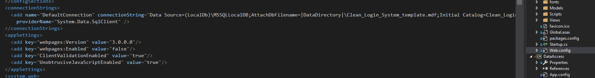
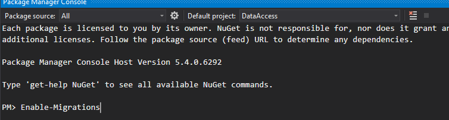
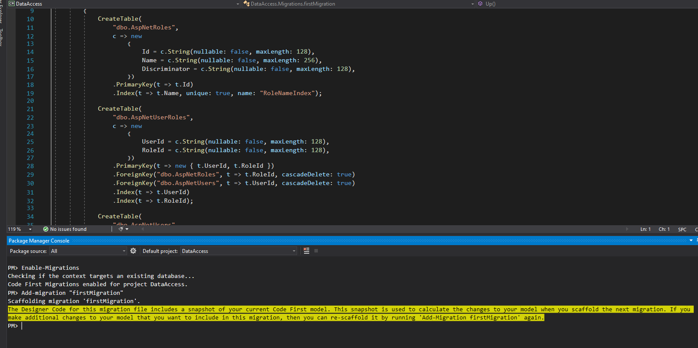
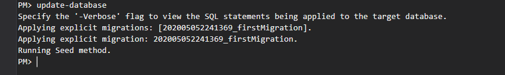
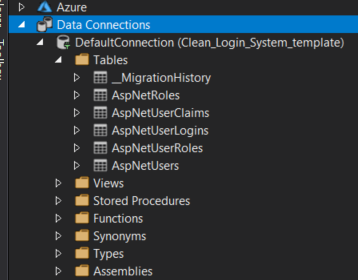
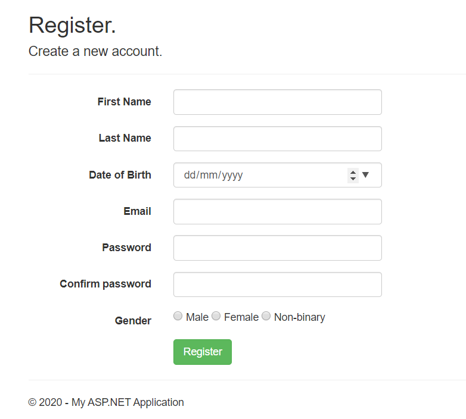
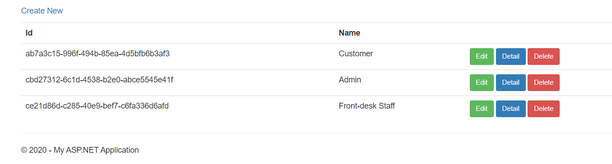

# Clean-login-system-template
Clean Login system with Role (CRUD operations) Template for ASP.NET.

# Instructions:

To Change Database Name:

Inside the project, Clean_Login-System-template find the file web.config
and change the name Clean_Login_System_template.mdf. For example login.mdf 

# set-up database using Code first Migrations

First Step:  Direct you default project to DataAccess or to your data layer and Enable-Migrations

Second Step: Add-migration

Third Step: Update-database

once the command is successful the local Database must display tables as shown in the picture

# Project Outcome

Registration Page:

Role Index Page:

